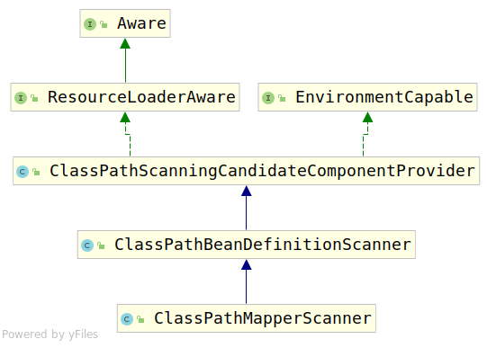

# 3.ClassPathMapperScanner

该类类图如下：



## 3.1 类注释

ClassPathMapperScanner用来根据basePackage, annotationClass和markerInterface三者的配置注册Mapper。如果annotationClass和markerInterface两者被指定了，则仅仅会注册指定的接口，全局扫描将会被关闭。此功能以前是MapperScannerConfigurer的私有类，但在1.2.0版中已被打破。

英文注释如下:

```java
/**
 * A {@link ClassPathBeanDefinitionScanner} that registers Mappers by
 * {@code basePackage}, {@code annotationClass}, or {@code markerInterface}. If
 * an {@code annotationClass} and/or {@code markerInterface} is specified, only
 * the specified types will be searched (searching for all interfaces will be
 * disabled).
 * <p>
 * This functionality was previously a private class of
 * {@link MapperScannerConfigurer}, but was broken out in version 1.2.0.
 *
 * @author Hunter Presnall
 * @author Eduardo Macarron
 * @see MapperFactoryBean
 * @since 1.2.0
 */
```

## 3.2 构造器

```java
public ClassPathMapperScanner(BeanDefinitionRegistry registry) {
    super(registry, false);
}
```

该类构造器仅仅调用了父类构造器，接下来考虑其父类构造器。

```java
public ClassPathBeanDefinitionScanner(BeanDefinitionRegistry registry, boolean useDefaultFilters) {
    this(registry, useDefaultFilters, getOrCreateEnvironment(registry));
}

public ClassPathBeanDefinitionScanner(BeanDefinitionRegistry registry, boolean useDefaultFilters,Environment environment) {
    this(registry, useDefaultFilters, environment,
            (registry instanceof ResourceLoader ? (ResourceLoader) registry : null));
}

public ClassPathBeanDefinitionScanner(BeanDefinitionRegistry registry, boolean useDefaultFilters,
            Environment environment, @Nullable ResourceLoader resourceLoader) {

        Assert.notNull(registry, "BeanDefinitionRegistry must not be null");
        this.registry = registry;

        if (useDefaultFilters) {
            registerDefaultFilters();
        }
        setEnvironment(environment);
        setResourceLoader(resourceLoader);
}
```

由此引入几个类需要深入考虑：ClassPathBeanDefinitionScanner、BeanDefinitionRegistry、Environment、ResourceLoader。详情查看3-1、3-2、3-3。

## 3.3 主要方法

### 3.3.1 registerFilters()方法

该方法主要用于将之前配置的扫描规则应用于ClassPathMapperScanner。

考虑该类的registerFilters()方法：

```java

    /**
     * Configures parent scanner to search for the right interfaces. It can search
     * for all interfaces or just for those that extends a markerInterface or/and
     * those annotated with the annotationClass
     */
    public void registerFilters() {
        boolean acceptAllInterfaces = true;

        // if specified, use the given annotation and / or marker interface
        if (this.annotationClass != null) {
            addIncludeFilter(new AnnotationTypeFilter(this.annotationClass));
            acceptAllInterfaces = false;
        }

        // override AssignableTypeFilter to ignore matches on the actual marker interface
        if (this.markerInterface != null) {
            addIncludeFilter(new AssignableTypeFilter(this.markerInterface) {
                @Override
                protected boolean matchClassName(String className) {
                    return false;
                }
            });
            acceptAllInterfaces = false;
        }

        if (acceptAllInterfaces) {
            // default include filter that accepts all classes
            addIncludeFilter(new TypeFilter() {
                @Override
                public boolean match(MetadataReader metadataReader, MetadataReaderFactory metadataReaderFactory) throws IOException {
                    return true;
                }
            });
        }

        // exclude package-info.java
        addExcludeFilter(new TypeFilter() {
            @Override
            public boolean match(MetadataReader metadataReader, MetadataReaderFactory metadataReaderFactory) throws IOException {true
                String className = metadataReader.getClassMetadata().getClassName();
                return className.endsWith("package-info");
            }
        });
    }

```

可以看到上述代码就是将之前配置的annotationClass转换为AnnotationTypeFilter，将markerInterface转换为AssignableTypeFilter，然后把配置不扫描package-info。

该类的父类维护了两个列表，分别是

```java
    private final List<TypeFilter> includeFilters = new LinkedList<>();

    private final List<TypeFilter> excludeFilters = new LinkedList<>();
```

分别代表了，需要的（includeFilters）和不需要的（excludeFilters），根据我们的配置。annotationClass是将指出需要指定的注解标注的接口，因此对其调用了addIncludeFilter()方法，将其加入到includeFilters中，markerInterface属性同理。由于我们不需要将package-info转化为对应的MapperFactoryBean，因此调用了addExcludeFilter()将其加入到excludeFilters中。

这样真正扫描时，也就只需要通过这两个列表，就能确定哪些类需要，哪些类不需要了。

### 3.3.2 doScan()方法

该方法负责真正的搜索满足条件的Bean定义，并放入到BeanDefinitionHolder返回。

考虑该类的doScan()方法：

```java
    /**
     * Calls the parent search that will search and register all the candidates.
     * Then the registered objects are post processed to set them as
     * MapperFactoryBeans
     */
    @Override
    public Set<BeanDefinitionHolder> doScan(String... basePackages) {
        Set<BeanDefinitionHolder> beanDefinitions = super.doScan(basePackages);

        if (beanDefinitions.isEmpty()) {
            logger.warn("No MyBatis mapper was found in '" + Arrays.toString(basePackages) + "' package. Please check your configuration.");
        } else {
            processBeanDefinitions(beanDefinitions);
        }

        return beanDefinitions;
    }
```

该方法扫描根据basePackage属性，扫描出了所有的包，并通过processBeanDefinitions(BeanDefinitionHolder)为beanDefinitions填充Mybatis属性。这里考虑processBeanDefinitions(beanDefinitions)方法。

```java
    private void processBeanDefinitions(Set<BeanDefinitionHolder> beanDefinitions) {
        GenericBeanDefinition definition;
        for (BeanDefinitionHolder holder : beanDefinitions) {
            definition = (GenericBeanDefinition) holder.getBeanDefinition();

            if (logger.isDebugEnabled()) {
                logger.debug("Creating MapperFactoryBean with name '" + holder.getBeanName()
                        + "' and '" + definition.getBeanClassName() + "' mapperInterface");
            }

            // the mapper interface is the original class of the bean
            // but, the actual class of the bean is MapperFactoryBean
            definition.getConstructorArgumentValues().addGenericArgumentValue(definition.getBeanClassName()); // issue #59
            definition.setBeanClass(this.mapperFactoryBean.getClass());
            //设置通用 Mapper
            if(StringUtils.hasText(this.mapperHelperBeanName)){
                definition.getPropertyValues().add("mapperHelper", new RuntimeBeanReference(this.mapperHelperBeanName));
            } else {
                //不做任何配置的时候使用默认方式
                if(this.mapperHelper == null){
                    this.mapperHelper = new MapperHelper();
                }
                definition.getPropertyValues().add("mapperHelper", this.mapperHelper);
            }

            definition.getPropertyValues().add("addToConfig", this.addToConfig);

            boolean explicitFactoryUsed = false;
            if (StringUtils.hasText(this.sqlSessionFactoryBeanName)) {
                definition.getPropertyValues().add("sqlSessionFactory", new RuntimeBeanReference(this.sqlSessionFactoryBeanName));
                explicitFactoryUsed = true;
            } else if (this.sqlSessionFactory != null) {
                definition.getPropertyValues().add("sqlSessionFactory", this.sqlSessionFactory);
                explicitFactoryUsed = true;
            }

            if (StringUtils.hasText(this.sqlSessionTemplateBeanName)) {
                if (explicitFactoryUsed) {
                    logger.warn("Cannot use both: sqlSessionTemplate and sqlSessionFactory together. sqlSessionFactory is ignored.");
                }
                definition.getPropertyValues().add("sqlSessionTemplate", new RuntimeBeanReference(this.sqlSessionTemplateBeanName));
                explicitFactoryUsed = true;
            } else if (this.sqlSessionTemplate != null) {
                if (explicitFactoryUsed) {
                    logger.warn("Cannot use both: sqlSessionTemplate and sqlSessionFactory together. sqlSessionFactory is ignored.");
                }
                definition.getPropertyValues().add("sqlSessionTemplate", this.sqlSessionTemplate);
                explicitFactoryUsed = true;
            }

            if (!explicitFactoryUsed) {
                if (logger.isDebugEnabled()) {
                    logger.debug("Enabling autowire by type for MapperFactoryBean with name '" + holder.getBeanName() + "'.");
                }
                definition.setAutowireMode(AbstractBeanDefinition.AUTOWIRE_BY_TYPE);
            }
        }
    }
```

该方法对已经注册了的BeanDefinition进行配置，由于BeanDefinition已经被注册进入到BeanFactory中，因此此处传入的是Set< BeanDefinitionHolder > 进行配置。

下面查看配置过程：

1. 从BeanDefinitionHolder中获取BeanDefinition

    ```java
    definition = (GenericBeanDefinition) holder.getBeanDefinition();
    ```

2. 设置Mapper类型，扫描到的类是Mapper接口，实际上是MapperFactoryBean类型。

    ```java
    definition.getConstructorArgumentValues().addGenericArgumentValue(definition.getBeanClassName()); // issue #59
    definition.setBeanClass(this.mapperFactoryBean.getClass());
    ```

3. 设置通用Mapper

    ```java
    //设置通用 Mapper
            if(StringUtils.hasText(this.mapperHelperBeanName)){
                definition.getPropertyValues().add("mapperHelper", new RuntimeBeanReference(this.mapperHelperBeanName));
            } else {
                //不做任何配置的时候使用默认方式
                if(this.mapperHelper == null){
                    this.mapperHelper = new MapperHelper();
                }
                definition.getPropertyValues().add("mapperHelper", this.mapperHelper);
            }
    ```

4. 配置SessionFactory和SessionTemplate

    ```java

            boolean explicitFactoryUsed = false;
            if (StringUtils.hasText(this.sqlSessionFactoryBeanName)) {
                definition.getPropertyValues().add("sqlSessionFactory", new RuntimeBeanReference(this.sqlSessionFactoryBeanName));
                explicitFactoryUsed = true;
            } else if (this.sqlSessionFactory != null) {
                definition.getPropertyValues().add("sqlSessionFactory", this.sqlSessionFactory);
                explicitFactoryUsed = true;
            }

            if (StringUtils.hasText(this.sqlSessionTemplateBeanName)) {
                if (explicitFactoryUsed) {
                    logger.warn("Cannot use both: sqlSessionTemplate and sqlSessionFactory together. sqlSessionFactory is ignored.");
                }
                definition.getPropertyValues().add("sqlSessionTemplate", new RuntimeBeanReference(this.sqlSessionTemplateBeanName));
                explicitFactoryUsed = true;
            } else if (this.sqlSessionTemplate != null) {
                if (explicitFactoryUsed) {
                    logger.warn("Cannot use both: sqlSessionTemplate and sqlSessionFactory together. sqlSessionFactory is ignored.");
                }
                definition.getPropertyValues().add("sqlSessionTemplate", this.sqlSessionTemplate);
                explicitFactoryUsed = true;
            }
    ```

5. 配置自动装配模式，装配方式是按类型装配。

    ```java
    if (!explicitFactoryUsed) {
        if (logger.isDebugEnabled()) {
                logger.debug("Enabling autowire by type for返回 MapperFactoryBean with name '" + holder.getBeanName() + "'.");
        }
        definition.setAutowireMode(AbstractBeanDefinition.AUTOWIRE_BY_TYPE);
    }
    ```
