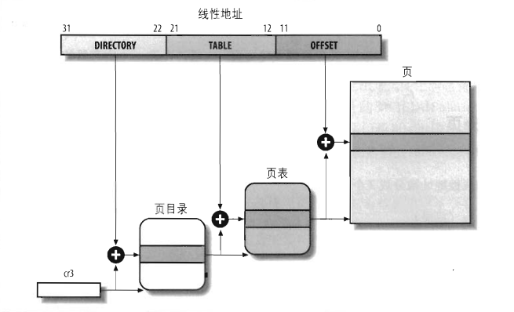
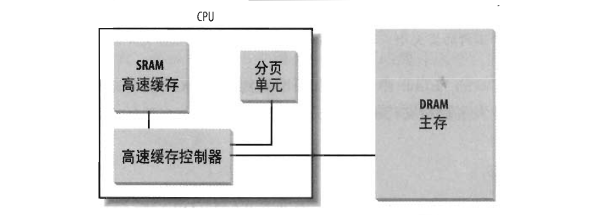

# 2.5 硬件中的分页

分页单元（paging unit）把线性地址转换成物理地址。其中的一个关键任务是把所请求的访问类型与线性地址的访问权限项比较，如果这次内存访问是无效的，就产生一个缺页异常。

为了效率起见，线性地址被分成以固定长度为单位的组，称为页（page）。页内部连续的线性地址被映射到连续的物理地址中。这样，内核可以指定一个页的物理地址和其存储权限，而不用指定页所包含的全部线性地址的存取权限。

分页单元把所有的RAM分成固定长度的页框（有时叫做物理页）。每一个页框包含一个页（page），也就是说一个页框的长度与一个页的长度一致。页框是主存的一部分，因此也是一个存储区域。

把线性地址映射到物理地址的数据结构称为页表。页表存放在主存中，并在启动分页单元之前必须由内核对页表进行适当的初始化。

从80386开始，所有的80x86处理器都支持分页，它通过设置cr0寄存器的PG标志启用。当PG=0时，线性地址就被解释成物理地址。

## 2.5.1 常规分页

从80386起，Intel处理器的分页单元处理4KB的页。

32位的线性地址被分为3个域：

- Directory(目录):最高10位。
- Table(页表)：中间10位。
- Offset(偏移量)：最低12位。

线性地址的转换分两步完成，每一步都基于一种转换表，第一种转换表称为页目录表，第二种转换表称为页表。

使用这种二级模式的目的在于减少每个进程页表所需RAM的数量。如果使用简单的一级页表，那将需要高达2^20个表项（也就是，在每项4哥字节时，需要4MB RAM）来表示每个进程的页表（如果进程使用全部4GB线性地址空间），即使一个进程并不使用那个范围内的所有地址。二级模式通过只为进程实际使用的那些虚拟内存区请求页表来减少内存容量。

每个活动进程必须有一个分配给它的页目录，不过没有必要马上为进程的所有页表都分配RAM。

正在使用的页目录的物理地址存放在控制寄存器cr3中。线性地址内的Dirrectory字段决定页目录中的目录项，而目录项指向适当的页表。地址的Table字段依次又决定页表中的表项，而表项含有页所在页框的物理地址。Offset字段决定页框内的相对位置，由于它是12位长，故每一页含有4096字节的数据。

Directory字段和Table字段都是10位长，因此页目录和页表都可以多达1024项。那么一个页目录可以寻址到高达1024*1024*4096=2^32个存储单元。

页目录和页表项有同样的结构，每项都包含如下字段：

1. Present标志：如果被置为1，所指的页（或页表）就在主存中。如果该标志为0，则这一页不在主存中，此时这个表剩余的位可由操作系统用于自己的目的。如果执行一个地址转换所需的页表项或页目录项中的Present标志被清0，那么分页单元就把该线性地址存放在控制寄存器cr2中，并产生14号异常：缺页异常。
2. 包含页框物理地址最高20位的字段：由于每一个页框有4KB的容量，它的物理地址必须是4096的倍数，因此物理地址的最低12位总是为0。如果这个字段指向一个页目录，相应的页框就含有一个页表，如果它指向一个页表，相应的页框就含有一页数据。
3. Accessed标志：每当分页单元对应页框进行寻址时就设置这个标志。当选出的页被交换出去时，这一标志就可以由操作系统使用。分页单元从来不重置这个标志，而是必须由操作系统去做。
4. Dirty标志：只应用于页表项中。每当对一个页框进行写操作时就设置这个标志。与Accessed标志一样，当选中的页被交换出去时，这一标志就可以由操作系统使用。分页单元从来不重置这个标志，而是必须由操作系统去做。
5. Read/Write标志：含有页或页表的存取权限（Read/Write或Read）。
6. User/Superisor标志：含有访问页或页表所需的特权级。
7. PCD和PWT标志：控制硬件告诉缓存处理页或页表的方式。
8. Page Size标志：只应用于页目录项。如果设置为1，则页目录项指的是2MB或4MB的页框。
9. Global标志：只应用于页表项。这个标志时在Pentium Pro中引入的，用来防止常用页从TLB（快表）高速缓存中刷新出去。只有在cr4寄存器的页全局启动（PGE）标志置位时这个标志才起作用。

## 2.5.2 扩展分页

从Pentiun模型开始，80x86微处理器引入了扩展分页，它允许页框的大小为4MB而不是4KB。扩展分页用于把大段连续的线性地址转换为相应的物理地址，在这些情况下，内核可以不用中间页表进行地址转换，从而节省内存并保留TLB项。

通过设置页目录字段的Page Size标志启用扩展分页功能。在这种情况下，分页单元把32位线性地址分成两个字段：

1. Directory: 最高10位
2. Offset: 其余22位

扩展分页和正常分页的页目录基本相同，除了：

- Page Size标志项必须被设置
- 20位物理地址字段只有最高10位时有物理意义的。这是因为一个物理地址都是再以4MB为边界的地方开始的，故这个地址的最低位为0。

通过设置cr4处理器寄存器的PSE标志能使扩展分页与常规分页共存。

## 2.5.3 硬件保护方案

分页单元和分段单元的保护方案不同。尽管80x86处理器允许一个段使用4种可能的特权级别。但与页和页表相关的特权级只有两个，因为特权由前面提到的User/Supervisor标志所控制。若这个标志为0，只有当CPL小于3（这意味着对于Linux而言，处理器处于内核态）时才能对页寻址；若该标志为1，则总能对页寻址。

此外，与段的3种存取权限（读、写、执行）不同的是，页的存取权限只有两种（读、写）。如果页目录项或页表项的Read/Write标志为0，则说明相应的页表或页是只读的，否则是可读写的。

## 2.5.4 物理地址扩展（PAE）分页机制

处理器所支持的RAM容量受连接到地址总线上的地址管脚数限制。早期Intel处理器从80386到Pentium使用32位物理地址。从理论上讲，这样的系统上可以安装高达4GB的RAM；而实际上，由于用户进程线性地址空间的需要，内核不能直接对1GB以上的RAM进行寻址。

然而，大型服务器需要大于4GB的RAM来同时运行数以千计的进程，这带来了一定的压力，所以必须扩展32位80x86结构所支持的RAM容量。

Intel通过在它的处理器上把管脚数从32增加到了36已经满足了这些需求。从Pentium Pro开始，Intel所有处理器现在寻址能力达2^36=64GB。不过，只有引入一种新的分页机制把32位线性地址转换为36位物理地址才能使用所增加的物理地址。

从Pentium Pro处理器开始，Intel引入一种叫做物理地址扩展（PAE）的机制。另外一种叫做页大小扩展（PSE）的机制再Pentium III处理器中引入，但是Linux并没有采用这种机制。

通过设置cr4控制寄存器中的物理地址扩展（PAE）标志激活PAE。页目录项中的页大小标志PS启用大尺寸页（在PAE启动时为2MB）。

Intel为了支持PAE已经改变了分页机制。

- 64GB的RAM被分为了2^24个页框，页表项的物理地址字段从20位扩展到了24位。因为PAE表项必须包含12个标志位和24哥物理地址位，总数值和为36，页表项大小从32位变为64位增加了一倍。结果一个4KB的页表包含512个表项而不是1024个表项。
- 引入一个叫做页目录指针表（PDPT）的页表新级别，它由4个64位表项组成。
- cr3控制寄存器包含一个27位的页目录指针表（PDPT）基地址字段。因为PDPT存放在RAM的前4GB中，并在32字节(2^5)的倍数上对其，因此27位足以表示这种表的基地址。
- 当把线性地址映射到4KB的页时（页目录项中PS标志清0），32位线性地址按如下方式解释：
  - cr3: 指向一个PDPT
  - 位31-30：指向PDPT中4个项中的一个
  - 位29-21：指向页目录中512个项中的一个
  - 位20-12：指向页表中512项中的一个
  - 位11-0： 4KB页中的偏移量
- 当把线性地址映射到2MB的页时（页目录项中的PS标志置为1），32位线性地址按下列方式解释：
  - cr3: 指向一个PDPT
  - 位31-30： 指向PDPT中4个项中的一个
  - 位29-21： 指向页目录中512个项中的一个
  - 位20-0： 2MB页中的偏移量

## 2.5.5 64位系统中的分页

32位微处理器普遍采用两级分页。然而两级分页并不适用于采用64位系统的计算机。原因如下：

假设一个大小为4KB的标准页。因为1KB覆盖2^10个地址的地址范围，4KB覆盖2^12个地址，所以offset字段是12位。这样线性地址就剩下521位分配给Table和Directory字段。如果我们现在决定仅仅使用64位中的48位来寻址（这个限制仍然使我们自在地拥有256TB的寻址空间！），剩下的48-12=36位将被分配给Table和Directory字段（这里减去的是表示offset的12位）。如果我们现在决定为两个字段各预留18位，那么每个进程的页目录和页表都含有2^18个项，超过了12位。

因此所有64位处理器的硬件分页系统都使用了额外的分页级别。使用的级别数量取决于处理器的类型，下表给出了部分例子：

| 平台名称 | 页大小 | 寻址使用的位数 | 分页即别数 | 线性地址分级 |
| -------- | ------ | -------------- | ---------- | ------------ |
| alpha    | 8 KB   | 43             | 3          | 10+10+10+13  |
| ia64     | 4KB    | 39             | 3          | 9+9+9+12     |
| x86_64   | 4KB    | 48             | 4          | 9+9+9+9+12   |

Linux提供了一种通用分页模型，它适用于绝大多数所支持的硬件分页系统。

## 2.5.6 硬件高速缓存

当今的微处理器时钟频率接近几个GHz，而动态RAM（DRAM）芯片的存取时间是时钟周期的数百倍。这意味着，当从RAM中取操作数或向RAM中存放结果这样的指令执行时，CPU可能等待很长时间。

为了缩小CPU和RAM之间的速度不匹配，引入了硬件高速缓存内存（hardware cache memory）。硬件高速缓存基于著名的局部性原理（locality principle），该原理既适用程序结构和也适用数据结构。这表明由于程序的循环结构及相关数组可以组织成线性数组，最近最常用的相邻地址在最近的将来又被用到的可能性极大。因此，引入小而快的内存来存放最近最常使用的代码和数据变得很有意义。为此，80x86体系结构中引入了一个叫行（line）的新单位。行由几十个连续的字节组成，它们以脉冲突发模式（burst mode）在慢速DRAM和快速的用来实现告诉缓存的片上静态RAM（SRAM）之间传送，用来实现高速缓存。

高速缓存再被细分为行的子集。在一种极端的情况下，高速缓存可以是直接映射的，这时主存中的一个行总是存放在高速缓存中完全相同的位置。在另一种极端情况下，高速缓存是充分关联的，这意味着主存中的任意一个行可以存放在高速缓存中任意位置。但是大多数高速缓存在某种程度上是N-路组关联的（N-way set associative），意味着主存中的任意一个行可以存放在高速缓存N行中的任意一行中。

如下图所示，高速缓存单元在分页单元额主内存之间。

高速缓存单元包含一个硬件高速缓存内存和一个高速缓存控制器。嘎usuhuancun内存存放内存中真正的行。高速缓存控制器存放一个表项数组，每个表项对应高速缓存内存中的一个行。每个表项有一个标签和描述高速缓存行状态的几个标志。这个标签由一些位组成，这些位让高速缓存控制器能够辨别由这个行当前所映射的内存单元。

当访问一个RAM存储单元时，CPU从物理地址中提取出子集的索引号并把子集中所有行的标签与物理地址的高几位相比较。如果发现某一个行的标签余这个物理地址的高位相同，则CPU命中一个高速缓存，否则，高速缓存没有命中。

当命中一个高速缓存时，高速缓存控制器进行不同的操作，具体取决于存储类型。对于读操作，控制器从高速缓存行中选取数据并送到CPU寄存器；不需要访问RAM而节约了CPU时间。因此高速缓存系统起到了其应有的作用。对于写操作，控制器可能采用以下两个基本策略之一，分别称之为通写和回写。在通写中，控制器总是既写RAM也写高速缓存行，为了提高写操作的效率关闭高速缓存。回写方式只更新高速缓存行，不改变RAM的内容，提供了更快的功效。当然，回写结束后，RAM最终必须被更新。只有当CPU执行一条要求刷新高速缓存表项的指令时，或者当一个FLUSH硬件信号产生时（通常在高速缓存不命中之后），高速缓存控制器才把高速缓存行写回到RAM中。

当高速缓存没有命中时，高速缓存行被写回到内存中，如果有必要的话，吧正确的行从RAM中取出放到高速缓存的表项中。

多处理器系统的每一个处理器都有一个单独的硬件高速缓存，因此它们需要额外的赢家电路用于保持高速缓存的同步。但是同步操作都在硬件处理，内核无需关心。

高速缓存技术正在快速向前发展。逐渐具有了多级缓存，但多级高速缓存之间的一致性是由硬件实现的。Linux忽略这些硬件细节并假定只有一个单独的高速缓存。

处理器的cr0寄存器的CD标志位用来启用或禁用高速缓存电路。这个寄存器中的NW标志指明高速缓存是通写还是回写策略。

Pentium处理器高速缓存的另一个有趣的特点是，让操作系统把不同的高速缓存管理策略与每一个页框相关联。为此，每一个页目录项和每一个页表项都包含两个标志：

- PCD（Page Cache Disabit）标志指明当访问包含在这个页框中的数据时，高速缓存功能必须被启用还是禁用。
- PWT（page Write-Through）标志指明当把数据写到页框时，必须使用的策略是回写策略还是通写策略。
  
Linux清除了所有页目录页项和页表项中的PCD和PWT标志；结果是：对于所有的页框都启用高速缓存，对于写操作总是采用回写策略。

## 2.5.7 转换后援缓冲器（TLB）

除了通用硬件高速缓存之外，80x86处理器还包含了另一个称为转换后援缓冲器或TLB（Translation Lookaside Buffer）的高速缓存用于加快线性地址的转换。当一个线性地址被第一个使用时，通过慢速访问RAM中的页表计算出相应的物理地址。同时物理地址被存放在一个TLB表项（TLB entry）中，以便以后对同一个线性地址的引用可以快速地得到转换。

在多处理器系统中，每个CPU都有自己的TLB，这叫做该CPU的本地TLB。与硬件高速缓存相反，TLB中的对应项不必同步，这是因为运行在现有CPU上的进程可以使同一线性地址与不同的物理地址发生联系。

当CPU的cr3控制寄存器被修改时，硬件自动使本地TLB中的所有项都无效，这是因为新的一组页表被启用而TLB指向的是旧数据。
