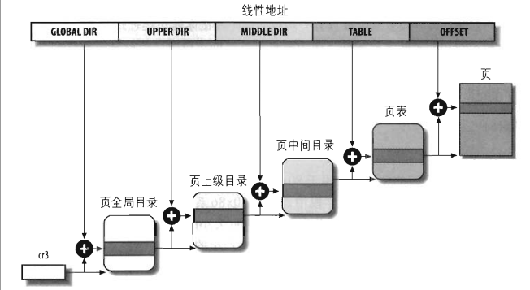

# 2.6 Linux中的分页

Linux采用了一种同时适用于32位和64位系统的普通分页模型。到2.6.10版本，Linux采用三级分页的模型。从2.6.11版本开始，采用了四级分页模型，分为4种页表如下：

- 页全局目录（Page Global Directory）
- 页上级目录（Page Upper Directory）
- 页中间目录（Page Middle Directory）
- 页表（Page Table）

结构如下图：

页全局目录包含若干页上级目录的地址，页上级目录又依次包含若干页中间目录的地址，而页中间目录又包含若干页表地址。因此线性地址被分成五个部分。上图没有显示位数，因为每一部分的大小与具体的计算机体系结构有关。

对于没有启用物理地址扩展的32位系统，两级页表已经足够了。Linux通过使“页上级目录”位和“页中间目录”位全为0，从根本上取消了页上集目录和页中间目录字段。不过，页上级目录和页中间目录在指针序列中的位置被保留，以便同样的代码在32位系统和64位系统下都能使用。内核为页上集目录和页中间目录保留了一个位置，这是通过把它们的页目录项数设置为1，并把这两个目录项映射到全局目录一个适当的目录而实现的。

启用了物理地址扩展的32位系统使用了三级页表。Linux的页全局目录对应80x86的页目录指针表（PDPT），取消了页上级目录，页中间目录对应80x86的页目录，Linux的页表对应80x86的页表。

64位系统位的使用三级目录还是四级目录取决于硬件对线性地址的划分。

Linux的进程处理很大程度上依赖于分页。事实上，线性地址到物理地址的自动转换使下面的设计目标变得可行：

- 给每一个进程分配一块不同的物理地址空间，这确保了可以有效地防止寻址错误。
- 区别页和页框的不同。这就允许存放在某一个页框中的一个页，然后保存到磁盘上，以后重新装入这同一页时又可以被装在不同的页框中。

每一个进程有它自己的页全局目录和自己的页表集。当发生进程切换时，Linux把cr3控制寄存器的内容保存在前一个执行进程的描述符中，然后把下一个要执行进程的描述符的值装入cr3寄存器中。因此，当新进程重新开始在CPU上执行时，分页单元指向一组正确的页表。

## 2.6.1 线性地址字段

下列宏简化了页表处理：

1. PAGE_SHIFT: 指定Offset字段的位数。当用于80x86处理器时，它产生的值为12。由于页内所有地址都必须能放到Offset字段中，因此80x86系统的页的大小是2^12=4096字节。PAGE_SHIFT的值为12可以看作2为底的页大小的对数。这个宏由PAGE_SIZE使用以返回页的大小。最后，PAGE_MASK宏产生的值为0xfffff000，用以屏蔽offset的所有位。
2. PMD_SHIFT：指定线性地址的Offset字段和Table字段的总位数。换句话说，是页中间目录项可以影射区域大小的对数。PMD_SIZE宏用于计算由页中间目录的一个单独表项所映射的区域大小，也就是一个页表的大小。PMD_MASK宏用于屏蔽Offset字段与Table字段的所有位。当PAE被禁用时，PMD_SHIFT产生的值为22（来自Offset的12位加上来自Table的10位），PMD_SIZE产生的值为2^22或4MB，PMD_MASK产生的值为0xffc00000。相反，当PAE被激活时，PMD_SHIFT产生的值为21（来自Offset的12位加上来自Table的9位），PMD_SIZE产生的值为2^21或2MB，PMD_MASK产生的值为0xffe00000。大型页不使用最后一级页表，所以产生大型页尺寸的LARGE_PAGE_SIZE宏等于PMD_SIZE（2PMD_SHIFT），而在大型页地址中用于屏蔽Offset字段和Table字段的所有位的LARGE_PAGE_MASK宏，就等于PMD_MASK。
3. PUD_SHIFT：确定页上级目录项能映射的区域大小的对数。PUD_SIZE宏用于计算页全局目录中的一个单独表项所能映射的区域大小。PUD_MASK宏用于屏蔽Offset字段、Table字段、Middle Air字段和Upper Air字段的所有位。在80x86处理器上，PUD_SHIFT总是等价于PMD_SHIFT，而PDU_SIZE则等于4MB或2MB。
4. PGDIR_SHIFT：确定页全局目录项能映射的区域大小的对数。PGDIR_SIZE宏用于计算页全局目录中一个单独表项所能映射区域的大小。PGDIR_MASK宏用于屏蔽Offset、Table、Middle Air及Upper Air字段的所有位。当PAE被禁止时，PGDIR_SHIFT产生的值为22（与PMD_SHIFT），PGDIR_SIZE产生的值为2^22或4MB，以及PGDIR_MASK产生的值为0xffc0000。相反，当PAE被激活时，PGDIR_SHIFT产生的值为30（12位Offset加9位Table再加9位Middle Air），PGDIR_SIZE产生的值为2^30或1GB以及PGDIR_MASK产生的值为0xc0000000。
5. PTRS_PER_PTE，PTRS_PER_PMD，PTRS_PTR_PUD以及PTRS_PER_PGD：用于计算页表、页中间表、页上级目录和页全局目录表中表项的个数。当PAE被禁止时，它们产生的值分别为1024，1，1和1024。当PAE被激活时，产生的值分别为512，512，1和4。

## 2.6.2 页表处理